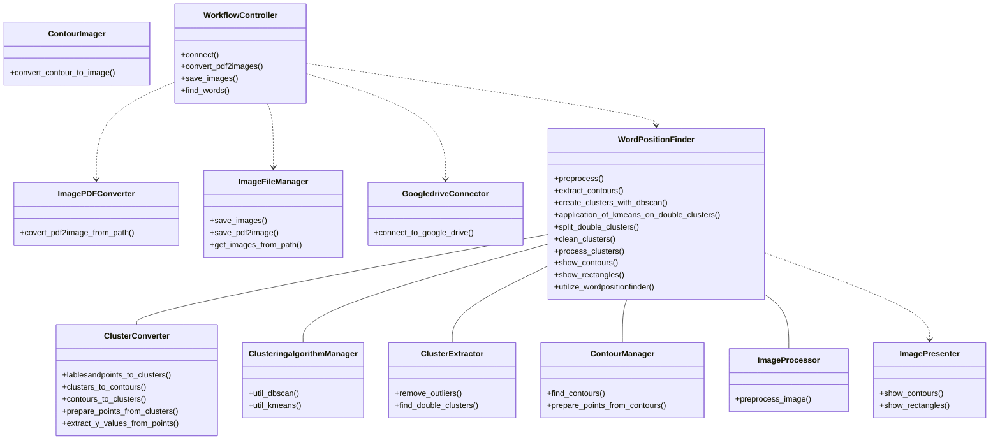

# Image-Preperation
Nutzung vom K-Means und DBSCAN Algorithmus zum positionalen erkennen von handgeschriebenen Wörtern

Im Projekt wird besondes auf die Erfüllung der SOLID Prinzipien(Single Responsibility Priciple, Interface Segregation Principle, Dependency Inversion Principle) geachtet. 
Die Liskov Substitution Priciple wird hier nicht implementiert da keine Vererbung genutzt wird und die Open/Closed Priciple wird aufgrund der Unübersichtlichkeit, bei einem so kleinen Projekt, außenvor gelassen.

## Vereinfachtes Klassendiagramm

