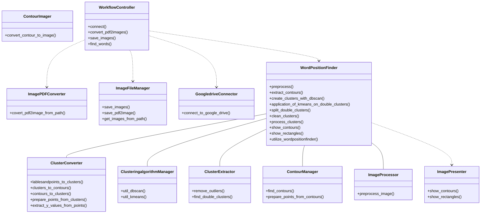

# Image-Preperation
Nutzung vom K-Means und DBSCAN Algorithmus zum positionalen erkennen von handgeschriebenen Wörtern

Im Projekt wird besondes auf die Erfüllung der SOLID Prinzipien(Single Responsibility Priciple, Interface Segregation Principle, Dependency Inversion Principle) geachtet. 
Die Liskov Substitution Priciple wird hier nicht implementiert da keine Vererbung genutzt wird und die Open/Closed Priciple wird aufgrund der Unübersichtlichkeit, bei einem so kleinen Projekt, außenvor gelassen.

Aus Datenschutzrechtlichen Gründen kann ich das Originale Bild nicht Hochladen, aber ich kann das Egebniss via Contouren und Boxen darstellen siehe unten.

Der Algorithmus funktioniert wie folgt:

- Eine gescannte PDF des handschriftlichen Dokuments wird eingelesen.
- Es wird in ein Bild konvertiert, Farben, Grautöne werden entfernt.
- Aus dem Bild werden die Konturen (Handschrift) Hierarchielos entnommen mit cv2.findContours. Es entsteht eine Punktewolke.
- Auf diese Punkte Wolke wird der DBSCAN-Algorithmus angewendet, welcher die Punkte zu Arealen verbindet (hoffentlich Wörter). Problem ist, dass Wörter die ein G, L, usw. haben in Gefahr laufen mit anderen Worten in anderen Zeilen verbunden zu werden, oder das aneinander geschriebene Wörter zu einem Areal verbunden werden.
- Zu große Cluster(Doppelworte oder Worte welche über zwei Zeilen(g & l/h)) werden herausgefiltert und mit KMeans in zwei Worte geteilt, das wird wiederholt bis es keine zu großen Cluster(unnatürliche Proportionen) gibt.
- Die zu großen Cluster werden mit dem DBSCAN-Algorithmus feingesäubert.
- Die Cluster werden in Konturen konvertiert und dargestellt als Bounding Boxes oder Konturen

Der Code enthält zusätzlich:
- Auslesung eines Googledrives für das ausgangs Dokument
- Konvertierung der Konturen in Bilder die nur die Wörter beinhalten
- Einlesen der Wort-Bilder in den Googledrive

## Vereinfachtes Klassendiagramm

```mermaid
classDiagram
direction TB
    class ImagePDFConverter {
	    +covert_pdf2image_from_path()
    }
    class ImageFileManager {
	    +save_images()
	    +save_pdf2image()
	    +get_images_from_path()
    }
    class GoogledriveConnector {
	    +connect_to_google_drive()
    }
    class ImageProcessor {
	    +preprocess_image()
    }
    class ContourImager {
	    +convert_contour_to_image()
    }
    class ContourManager {
	    +find_contours()
	    +prepare_points_from_contours()
    }
    class ImagePresenter {
	    +show_contours()
	    +show_rectangles()
    }
    class ClusterExtractor {
	    +remove_outliers()
	    +find_double_clusters()
    }
    class ClusterConverter {
	    +lablesandpoints_to_clusters()
	    +clusters_to_contours()
	    +contours_to_clusters()
	    +prepare_points_from_clusters()
	    +extract_y_values_from_points()
    }
    class ClusteringalgorithmManager {
	    +util_dbscan()
	    +util_kmeans()
    }
    class WordPositionFinder {
	    +preprocess()
	    +extract_contours()
	    +create_clusters_with_dbscan()
	    +application_of_kmeans_on_double_clusters()
	    +split_double_clusters()
	    +clean_clusters()
	    +process_clusters()
	    +show_contours()
	    +show_rectangles()
	    +utilize_wordpositionfinder()
    }
    class WorkflowController{
        +connect()
        +convert_pdf2images()
        +save_images()
        +find_words()
    }
    WordPositionFinder -- ClusterConverter
    WordPositionFinder -- ClusteringalgorithmManager
    WordPositionFinder -- ClusterExtractor
    WordPositionFinder -- ContourManager
    WordPositionFinder -- ImageProcessor
    WordPositionFinder ..> ImagePresenter 
    WorkflowController ..> WordPositionFinder 
    WorkflowController ..> ImageFileManager 
    WorkflowController ..> GoogledriveConnector 
    WorkflowController ..> ImagePDFConverter
```

<!-- Die Darstellung mit HTML ist völlig KI generiert, ich weis nicht wie mann mit HTML umgeht und es intressiert mich auch nicht-->
<table>
  <tr>
    <td></td>
    <td></td>
  </tr>
</table>

